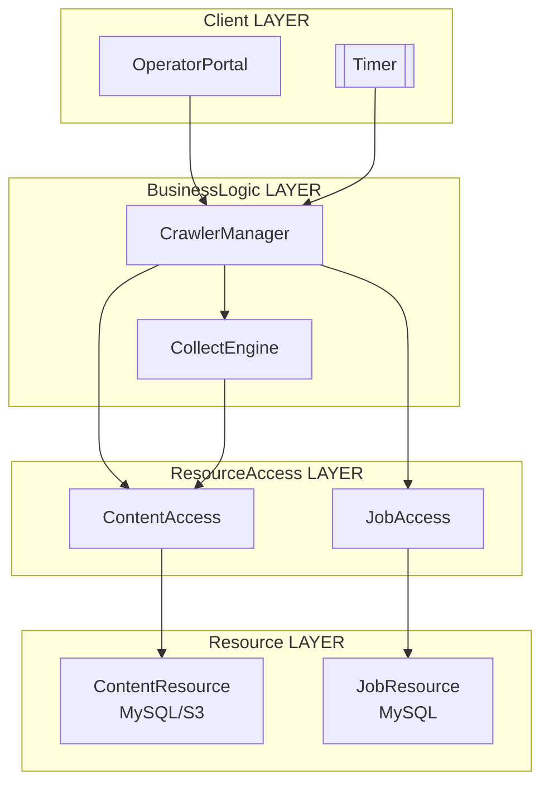
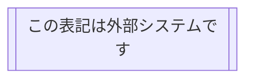

# Structure

## Overview

```mermaid
flowchart TD
    subgraph Client LAYER
        C1[OperatorPortal]
        C2[[Timer]]
    end
    subgraph BusinessLogic LAYER
        BA1[CrawlerManager]
        BE1[CollectEngine]
    end
    subgraph ResourceAccess LAYER
        A1[ContentAccess]
        A2[JobAccess]
    end
    subgraph Resource LAYER
        R1[ContentResource\nMySQL/S3]
        R2[JobResource\nMySQL]
    end

    C1 --> BA1
    C2 --> BA1
    BA1 --> BE1
    BA1 --> A1
    BE1 --> A1
    BA1 --> A2
    A1 --> R1
    A2 --> R2
```

補足

```mermaid
flowchart
    A[[この表記は外部システムです]]
```
